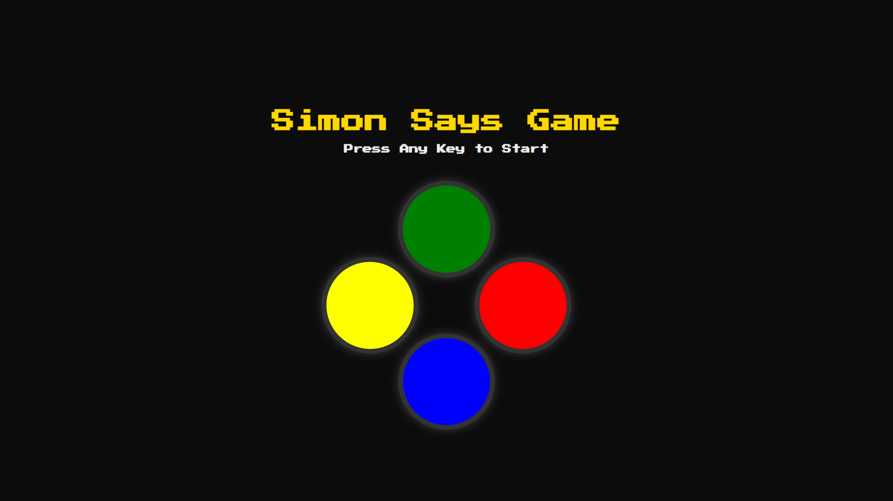

# Simon Says Game🎮

A classic memory game built for the web, designed to challenge your memory and pattern recognition skills. The game is a simple, yet engaging, recreation of the classic "Simon" electronic game.

## Features

-   **Memory Challenge**: Follow the sequence of flashing colors and sounds.
-   **Increasing Difficulty**: The game adds a new color to the sequence with each successful round.
-   **Score Tracking**: Displays your current score and highest score, encouraging you to beat your personal best.
-   **Responsive Design**: Built to be playable on both desktop and mobile browsers.

## Technologies Used

-   **HTML5**: For the game's structure and layout
-   **CSS3**: For styling, animations, and creating an intuitive user interface
-   **JavaScript**: For the core game logic, sequence generation, user input handling, and score management

## How to Play

1.  Press any key to start the game.
2.  The game will flash a sequence of colors.
3.  Repeat the sequence by clicking on the correct colors in the correct order.
4.  If you get the sequence right, the game will move to the next level by adding another color to the sequence.
5.  If you make a mistake ❌, the game is over. Your score and the highest score will be displayed.

## Installation⚡

To run this project locally, simply clone the repository and open the `index.html` file in your web browser.

```bash
git clone https://github.com/MirAfaqueAlli/simon-says-game.git
```

## Screenshot🖼️


## Future Enhancements
-  Adding sound effects for each color
-  Implementing different difficulty levels
-  Creating an animated game over screen
-  Adding a local leaderboard to save high scores
